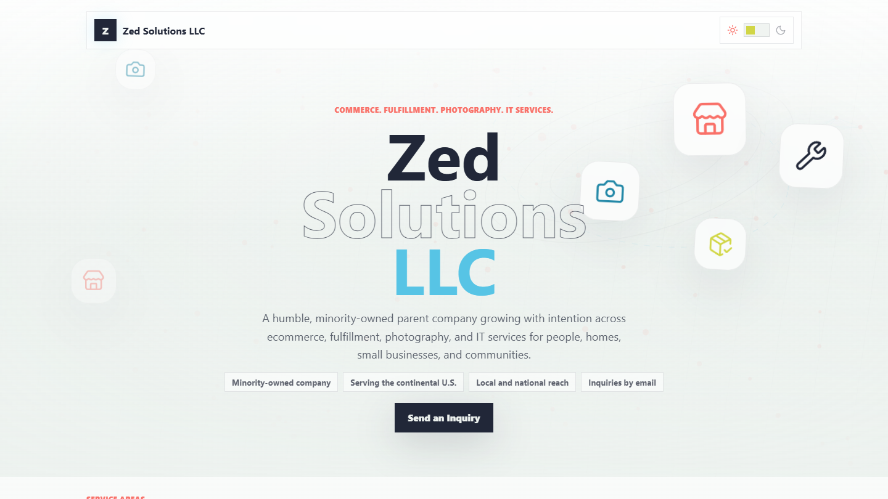
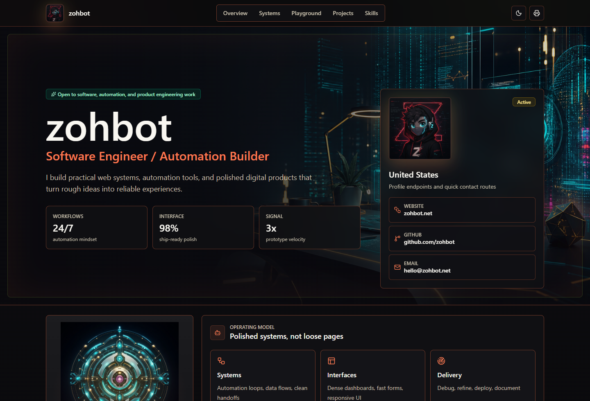
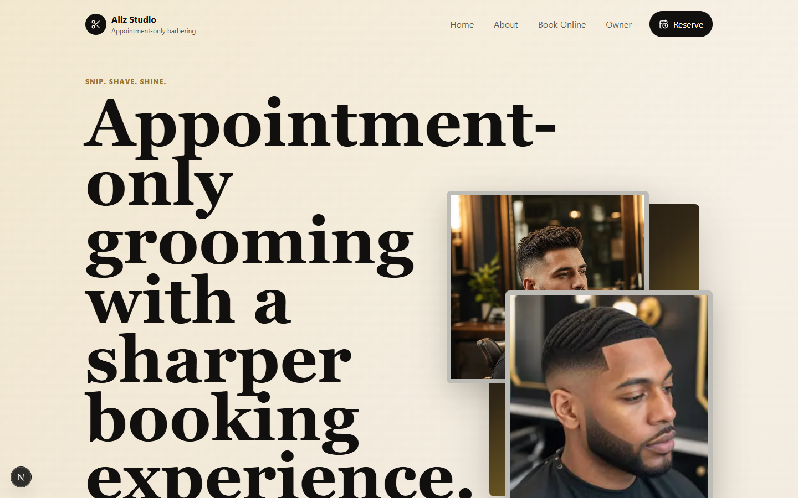

  

  
  
  
  
  

# Hi, I'm Syed

I build practical web experiences, brand systems, small business tooling, and hands-on home lab infrastructure with a focus on clean interfaces, responsive layouts, observability, secure access, and deployment-ready details.

Right now I am working across front-end development, business website builds, visual QA, DevOps/home lab operations, brand identity systems, and 3D/Cinema 4D material workflows.

For website, template, automation, and customer project inquiries, visit [World Softwares](https://worldsoftwares.com).

## Current Focus

- Building polished landing pages and business websites with React, Vite, HTML, CSS, and static deployment workflows
- Running a practical home lab with Raspberry Pi services, Docker container management, monitoring, private DNS, and staged hardware migration work
- Creating brand systems for Zed Solutions LLC, including logo direction, identity assets, email signature materials, and website presentation
- Auditing live websites for technology stack, animation patterns, tracking tools, accessibility widgets, and UX behavior
- Exploring Cinema 4D / Redshift scenes, PBR materials, product-style rendering, and dynamic 3D text concepts

## Latest Project Updates

- **Masjid Fatima Website Draft:** published as a mosque website and early web-app rebuild with multilingual visitor UX, a staff dashboard foundation, proprietary licensing, and DevSecOps hardening.
- **Aliz Studio:** upgraded with mock Square-style checkout, paid appointment confirmation, owner auth hardening, security headers, API validation, and a fresh showcase capture.
- **TECHNOseller Portal:** polished as a public vendor marketplace concept with searchable listings, buyer lead capture, moderation workflows, and passing Node API tests.
- **Zohbot Web Resume:** updated with a hardened Vite build configuration, polished footer credit, and customer-facing README notes.
- **Cloud Website:** refreshed as a buyer-ready static website template with clear tech notes, SYHTEK inquiry paths, and consistent footer credit.
- **Profile Showcase:** refreshed with the zohbot-only banner, screenshot-backed project cards, public repository table, and Aliz Studio included in the website builds.

## Toolkit

  
  
  
  
  
  
  
  
  
  
  
  
  
  
  
  
  
  
  

## Home Lab / DevOps

<table>
  <tr>
    <td width="50%" valign="top">
      <h3>Raspberry Pi Production Migration</h3>
      
Planning and staging a Raspberry Pi 3B to Raspberry Pi 5 migration by preparing the Pi 5 first, validating services, and cutting over only after the replacement environment is ready.

      
<strong>Focus areas:</strong> staged migration, production replacement planning, service validation, rollback-aware thinking.

    </td>
    <td width="50%" valign="top">
      <h3>Monitoring Stack</h3>
      
Running Node Exporter on the Pi and using Grafana from an Oracle VM on the desktop to monitor system health and infrastructure behavior.

      
<strong>Focus areas:</strong> metrics collection, dashboards, host monitoring, Grafana visualization, Prometheus-style observability.

    </td>
  </tr>
  <tr>
    <td width="50%" valign="top">
      <h3>Docker Container Management</h3>
      
Setting up Portainer to manage Docker containers with a cleaner interface for container lifecycle work and local service administration.

      
<strong>Focus areas:</strong> Docker operations, Portainer, container visibility, service management.

    </td>
    <td width="50%" valign="top">
      <h3>Private DNS and Secure Access</h3>
      
Deployed <code>ctrld</code> with a DoH3 NextDNS resolver and set up Tailscale for secure private access across local infrastructure.

      
<strong>Focus areas:</strong> encrypted DNS, DNS filtering, private networking, secure remote access, home lab security.

    </td>
  </tr>
  <tr>
    <td width="50%" valign="top">
      <h3>Local Infrastructure Practice</h3>
      
Building hands-on infrastructure habits around staging, monitoring, containerization, networking, and small-server operations instead of treating deployments as one-off installs.

      
<strong>Focus areas:</strong> home lab operations, Linux services, virtualization, observability, maintainable systems.

    </td>
    <td width="50%" valign="top">
      <h3>Operational Security Mindset</h3>
      
Keeping local services easier to operate by pairing observability with private access controls and DNS-level protections.

      
<strong>Focus areas:</strong> least-exposed services, secure administration, monitoring coverage, infrastructure hygiene.

    </td>
  </tr>
</table>

## Website Builds and Product Concepts

<table>
  <tr>
    <td width="50%" valign="top">
      
      <h3>Zed Solutions LLC</h3>
      
A business splash page and brand workspace for a parent company focused on ecommerce, fulfillment support, photography services, IT services, and practical business infrastructure.

      
<strong>Stack:</strong> React, Vite, custom CSS animation, Cloudflare Pages direction, responsive visual QA.

      
<strong>Credit:</strong> Website design and implementation by <a href="https://worldsoftwares.com">SYHTEK</a>.

    </td>
    <td width="50%" valign="top">
      
      <h3>TECHNOseller Portal</h3>
      
A marketplace and vendor-directory SaaS concept with synthetic listings, searchable service data, vendor profiles, buyer lead capture, and moderation workflows.

      
<strong>Stack:</strong> React, Vite, Tailwind CSS, Radix primitives, Node HTTP API, structured marketplace data.

      
<strong>Credit:</strong> Product direction and implementation by <a href="https://worldsoftwares.com">SYHTEK</a>.

    </td>
  </tr>
  <tr>
    <td width="50%" valign="top">
      
      <h3>Zohbot Web Resume</h3>
      
A clean-room web resume for zohbot.net with a modern React interface, print-friendly resume view, project sections, and contact routes.

      
<strong>Stack:</strong> React, Vite, Tailwind CSS, Radix-style components, GitHub Pages publishing direction.

      
<strong>Credit:</strong> Visual system and implementation by <a href="https://worldsoftwares.com">SYHTEK</a>.

    </td>
    <td width="50%" valign="top">
      
      <h3>Aliz Studio</h3>
      
An appointment-only barbershop website with premium visual direction, service packaging, a guided booking flow, mock deposit checkout, and owner dashboard operations.

      
<strong>Stack:</strong> Next.js App Router, React, TypeScript, custom CSS tokens, Square-ready API routes, signed owner sessions, Playwright checks.

      
<strong>Credit:</strong> Website design, booking UX, and implementation by <a href="https://worldsoftwares.com">SYHTEK</a>.

    </td>
  </tr>
  <tr>
    <td colspan="2" valign="top">
      
      <h3>Masjid Fatima Website Draft</h3>
      
A mosque website and early community web-app rebuild with prayer-time continuity, multilingual visitor paths, donation/media links, a staff dashboard foundation, and a proprietary public-showcase license.

      
<strong>Stack:</strong> Plain JavaScript modules, custom CSS, Vite, Node HTTP API, PWA basics, Playwright, local DevSecOps hardening.

      
<strong>Credit:</strong> Website draft, logo exploration, app foundation, and DevSecOps pass by <a href="https://worldsoftwares.com">SYHTEK</a>.

    </td>
  </tr>
</table>

## Other Technical Work

<table>
  <tr>
    <td width="50%" valign="top">
      <h3>Proweaver Website Technology Audit</h3>
      
A detailed technology and animation audit of a live WordPress marketing site, covering front-end libraries, animation systems, analytics/tracking scripts, accessibility tools, forms, hosting signals, and visible UX behavior.

      
<strong>Focus areas:</strong> WordPress, jQuery, animation libraries, tracking pixels, Cloudflare behavior, UI/UX analysis, technical documentation.

    </td>
    <td width="50%" valign="top">
      <h3>Cinema 4D / Redshift Material Workflows</h3>
      
A starter material library and scene workflow using CC0 PBR texture sets for Redshift and Cinema 4D experiments.

      
<strong>Focus areas:</strong> PBR map wiring, material setup, 3D scene composition, chrome/neon styling, dynamic text, and render-ready asset organization.

    </td>
  </tr>
</table>

## Public Website Project Links

Public project entries with buyer-facing notes, screenshots where useful, and World Softwares inquiry routing.

| Repository | What It Shows | Tech |
| --- | --- | --- |
| [Cloud-Website](https://worldsoftwares.com) | Static cloud-hosting website template | HTML, CSS, responsive static pages |
| [technoseller](https://worldsoftwares.com) | Vendor marketplace and lead-routing concept | React, Vite, TypeScript, Tailwind CSS, Node API |
| [webresume](https://worldsoftwares.com) | Modern portfolio/resume website | React, Vite, Tailwind CSS, Radix-style components |
| [Aliz-Studio](https://worldsoftwares.com) | Appointment-based barbershop website, mock checkout, and owner dashboard | Next.js, React, TypeScript, Square-ready API routes, Playwright |
| [masjid-fatima-draft](https://worldsoftwares.com) | Mosque website and early community web-app rebuild | Plain JavaScript, Vite, Node API, PWA, Playwright, DevSecOps hardening |

## Skills

**Front-end:** React, Vite, HTML, CSS, responsive design, static sites, landing pages

**DevOps and home lab:** Raspberry Pi migration planning, Docker, Portainer, Grafana dashboards, Node Exporter, Oracle VM, Tailscale, `ctrld`, NextDNS, DoH3 encrypted DNS, staged cutovers, local infrastructure monitoring

**Testing and QA:** Playwright, visual regression checks, screenshot review, browser-based inspection

**Web audits:** WordPress stack review, JavaScript/CSS library identification, analytics and tracking review, UX behavior documentation

**Deployment:** Cloudflare Pages, GitHub Pages, static hosting workflows

**Design systems:** Brand briefs, identity systems, logo direction, shared assets, email signature concepts

**3D and visuals:** Cinema 4D, Redshift, PBR materials, texture map workflows, product-style rendering concepts

## What I Like Building

I like projects that turn rough ideas into something structured and usable: a brand system that can actually ship, a website that feels clean on both desktop and mobile, or a home lab service that is staged, monitored, privately accessible, and easier to operate over time.

## Links

- GitHub: [zohbot](https://github.com/zohbot)
- Website inquiries: [World Softwares](https://worldsoftwares.com)
- Public project links: [Cloud-Website](https://worldsoftwares.com), [technoseller](https://worldsoftwares.com), [webresume](https://worldsoftwares.com), [Aliz-Studio](https://worldsoftwares.com), [masjid-fatima-draft](https://worldsoftwares.com)
