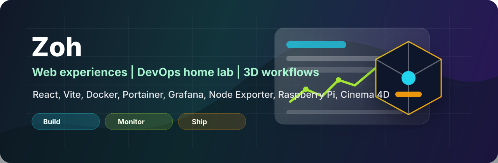

  

  
  
  
  
  

# Hi, I'm Zoh

I build practical web experiences, brand systems, small business tooling, and hands-on home lab infrastructure with a focus on clean interfaces, responsive layouts, observability, and deployment-ready details.

Right now I am working across front-end development, business website builds, visual QA, DevOps/home lab operations, brand identity systems, and 3D/Cinema 4D material workflows.

## Current Focus

- Building polished landing pages and business websites with React, Vite, HTML, CSS, and static deployment workflows
- Running a practical home lab with Raspberry Pi services, Docker container management, monitoring, and staged hardware migration work
- Creating brand systems for Zed Solutions LLC, including logo direction, identity assets, email signature materials, and website presentation
- Auditing live websites for technology stack, animation patterns, tracking tools, accessibility widgets, and UX behavior
- Exploring Cinema 4D / Redshift scenes, PBR materials, product-style rendering, and dynamic 3D text concepts

## Toolkit

  
  
  
  
  
  
  
  
  
  
  
  
  
  
  
  

## Home Lab / DevOps

<table>
  <tr>
    <td width="50%" valign="top">
      <h3>Raspberry Pi Production Migration</h3>
      
Planning and staging a Raspberry Pi 3B to Raspberry Pi 5 migration by preparing the Pi 5 first, validating services, and cutting over only after the replacement environment is ready.

      
<strong>Focus areas:</strong> staged migration, production replacement planning, service validation, rollback-aware thinking.

    </td>
    <td width="50%" valign="top">
      <h3>Monitoring Stack</h3>
      
Running Node Exporter on the Pi and using Grafana from an Oracle VM on the desktop to monitor system health and infrastructure behavior.

      
<strong>Focus areas:</strong> metrics collection, dashboards, host monitoring, Grafana visualization, Prometheus-style observability.

    </td>
  </tr>
  <tr>
    <td width="50%" valign="top">
      <h3>Docker Container Management</h3>
      
Setting up Portainer to manage Docker containers with a cleaner interface for container lifecycle work and local service administration.

      
<strong>Focus areas:</strong> Docker operations, Portainer, container visibility, service management.

    </td>
    <td width="50%" valign="top">
      <h3>Local Infrastructure Practice</h3>
      
Building hands-on infrastructure habits around staging, monitoring, containerization, and small-server operations instead of treating deployments as one-off installs.

      
<strong>Focus areas:</strong> home lab operations, Linux services, virtualization, observability, maintainable systems.

    </td>
  </tr>
</table>

## Featured Projects

<table>
  <tr>
    <td width="50%" valign="top">
      <h3>Zed Solutions LLC</h3>
      
A business splash page and brand workspace for a parent company focused on ecommerce, fulfillment support, photography services, IT services, and practical business infrastructure.

      
<strong>Tech and workflow:</strong> React, Vite, custom CSS animation, Cloudflare Pages, Playwright visual checks, brand asset organization, responsive layout design.

    </td>
    <td width="50%" valign="top">
      <h3>Proweaver Website Technology Audit</h3>
      
A detailed technology and animation audit of a live WordPress marketing site, covering front-end libraries, animation systems, analytics/tracking scripts, accessibility tools, forms, hosting signals, and visible UX behavior.

      
<strong>Focus areas:</strong> WordPress, jQuery, animation libraries, tracking pixels, Cloudflare behavior, UI/UX analysis, technical documentation.

    </td>
  </tr>
  <tr>
    <td width="50%" valign="top">
      <h3>Cinema 4D / Redshift Material Workflows</h3>
      
A starter material library and scene workflow using CC0 PBR texture sets for Redshift and Cinema 4D experiments.

      
<strong>Focus areas:</strong> PBR map wiring, material setup, 3D scene composition, chrome/neon styling, dynamic text, and render-ready asset organization.

    </td>
    <td width="50%" valign="top">
      <h3>Web Resume</h3>
      
A GitHub Pages resume project based on a Jekyll template.

      
<a href="https://github.com/zohbot/web-resume">View repository</a>

    </td>
  </tr>
</table>

## Public Work

  
  

## GitHub Snapshot

  
  

## Skills

**Front-end:** React, Vite, HTML, CSS, responsive design, static sites, landing pages

**DevOps and home lab:** Raspberry Pi migration planning, Docker, Portainer, Grafana dashboards, Node Exporter, Oracle VM, staged cutovers, local infrastructure monitoring

**Testing and QA:** Playwright, visual regression checks, screenshot review, browser-based inspection

**Web audits:** WordPress stack review, JavaScript/CSS library identification, analytics and tracking review, UX behavior documentation

**Deployment:** Cloudflare Pages, GitHub Pages, static hosting workflows

**Design systems:** Brand briefs, identity systems, logo direction, shared assets, email signature concepts

**3D and visuals:** Cinema 4D, Redshift, PBR materials, texture map workflows, product-style rendering concepts

## What I Like Building

I like projects that turn rough ideas into something structured and usable: a brand system that can actually ship, a website that feels clean on both desktop and mobile, or a home lab service that is staged, monitored, and easier to operate over time.

## Links

- GitHub: [zohbot](https://github.com/zohbot)
- Public repos: [Cloud-Website](https://github.com/zohbot/Cloud-Website), [web-resume](https://github.com/zohbot/web-resume)
